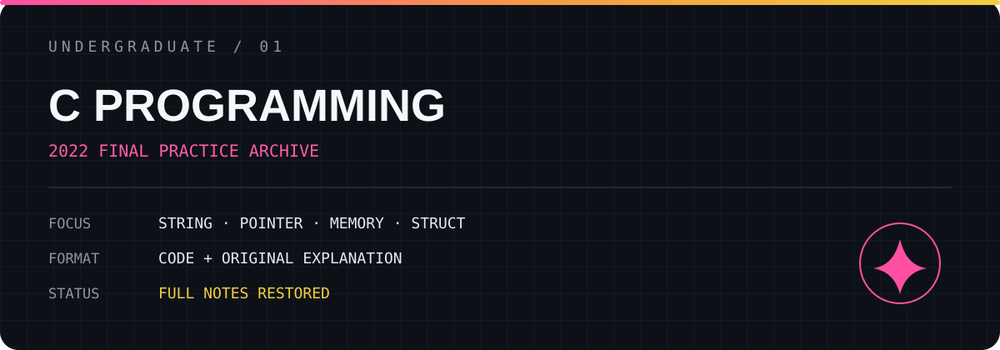

# C Programming

2022년 C언어 기말 실습에서 작성한 코드와 풀이 과정을 보존한 학습 저장소입니다.

## Archive

- [전체 실습 코드와 설명 보기](./FULL_NOTES.md)
- 문제 번호 **1091–1130** 범위의 문자열, 포인터, 동적 할당, 구조체, 배열 실습
- 작성 당시의 접근 방식과 코드 설명을 함께 보존

## Technical Scope

`C` · `String Processing` · `Pointers` · `Dynamic Memory` · `Structures` · `2D Arrays` · `Bit Operations`

## Note

이 저장소는 학습 당시의 사고 과정까지 남기는 아카이브입니다. 개인정보만 제거했으며, 코드와 풀이 내용은 임의로 축약하지 않았습니다.

